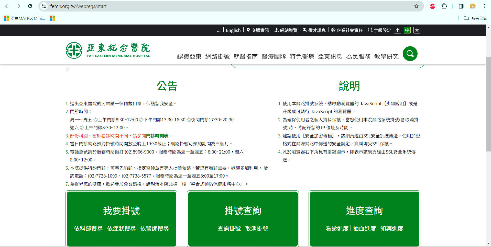
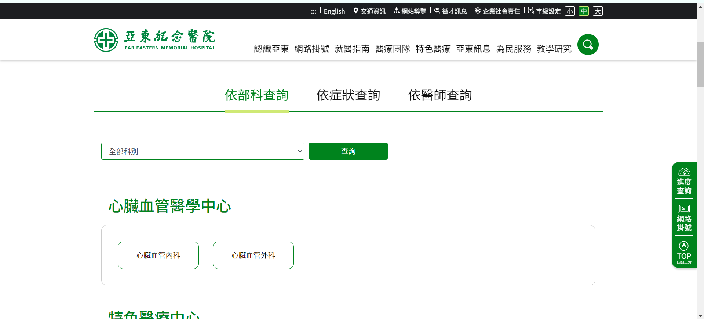
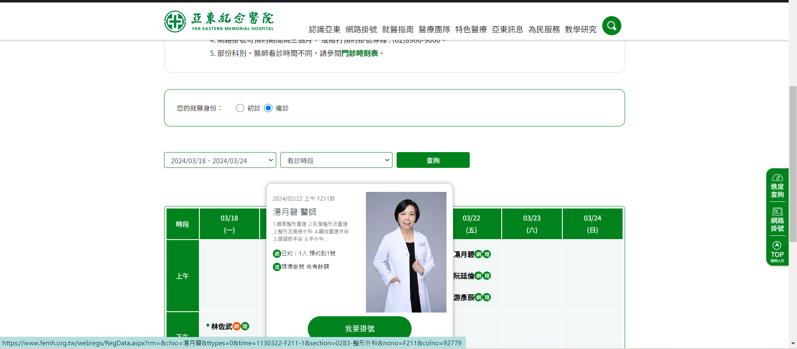
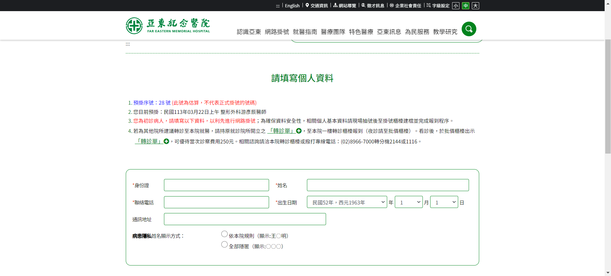
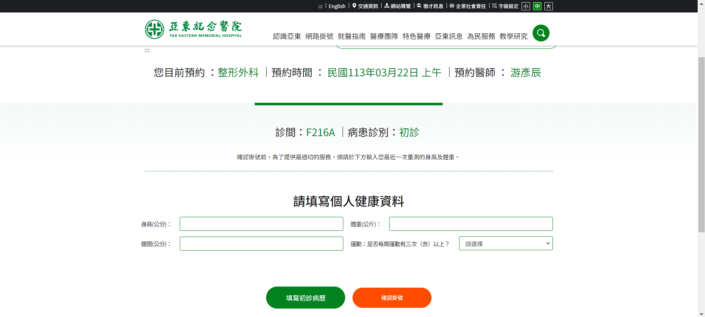
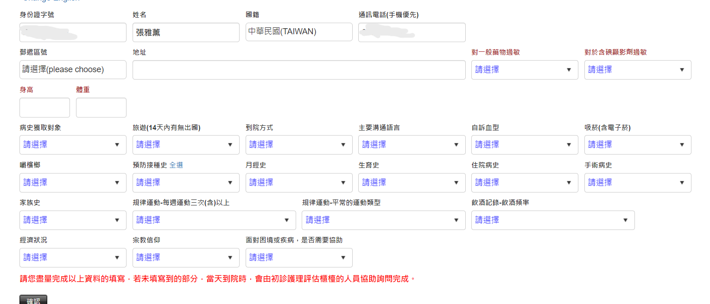
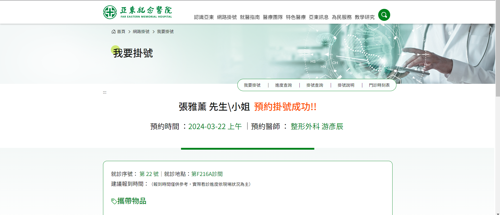
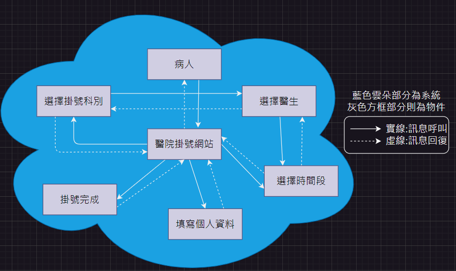
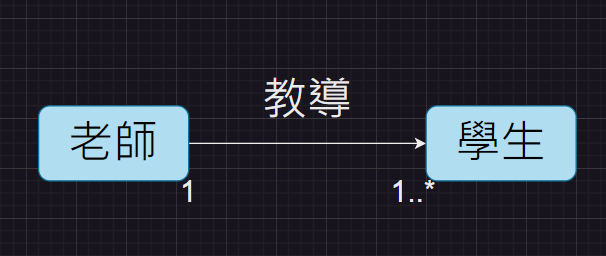

# 第2次作業-作業-HW2
>
>學號：111111109
> 
>姓名：張雅薰
> 
>作業撰寫時間：40 (mins，包含程式撰寫時間)
> 
>最後撰寫文件日期：2024/03/25
>

本份文件包含以下主題：(至少需下面兩項，若是有多者可以自行新增)
- [x] 說明內容
- [x] 個人認為完成作業須具備觀念

## 說明程式與內容

1.開啟亞東醫院掛號系統
物件:我要掛號、掛號查詢、進度查詢 

2.選擇科部
物件:依部科查詢、依症狀查詢、依醫師查詢、科別名稱 

3.選擇掛號日期與醫師
物件:初診複診、選擇時間與醫師、提交掛號 

4.填寫個人資料
物件:預掛序號、身分證、連絡電話、通訊地址、姓名、出生日期 

5.填寫個人健康資料
物件:身高、體重、腰圍、運動頻率 

6.因為是初診，所以需要填寫初診病歷
物件:身分證、姓名、國籍、連絡電話、郵遞區號、地址、身高、體重、病史 

7.掛號成功

answer1.drawio截圖

answer2.drawio截圖

## 個人認為完成作業須具備觀念

開始寫說明，需要說明本次作業個人覺得需學會那些觀念，亦可作為學習筆記使用 (需寫成文章，需最少50字，並且文內不得有你、我、他三種文字)